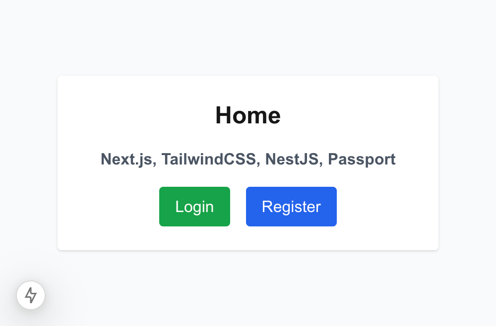
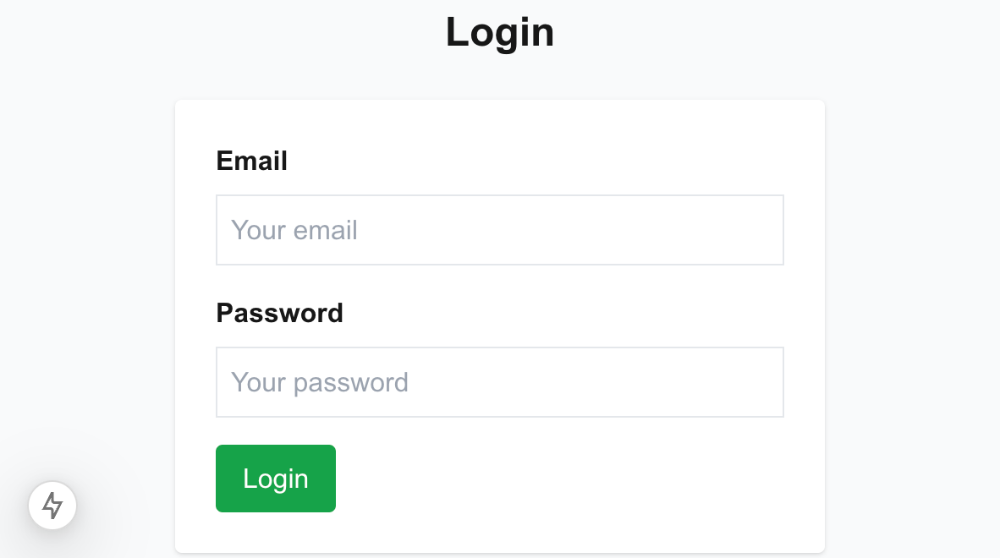
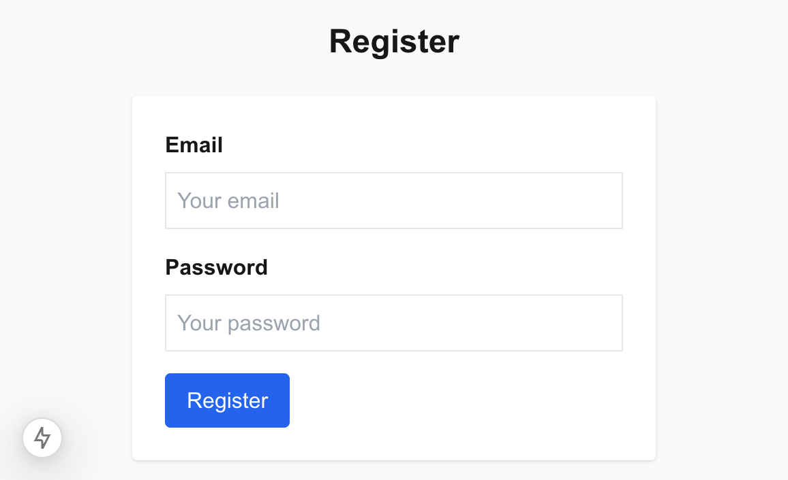
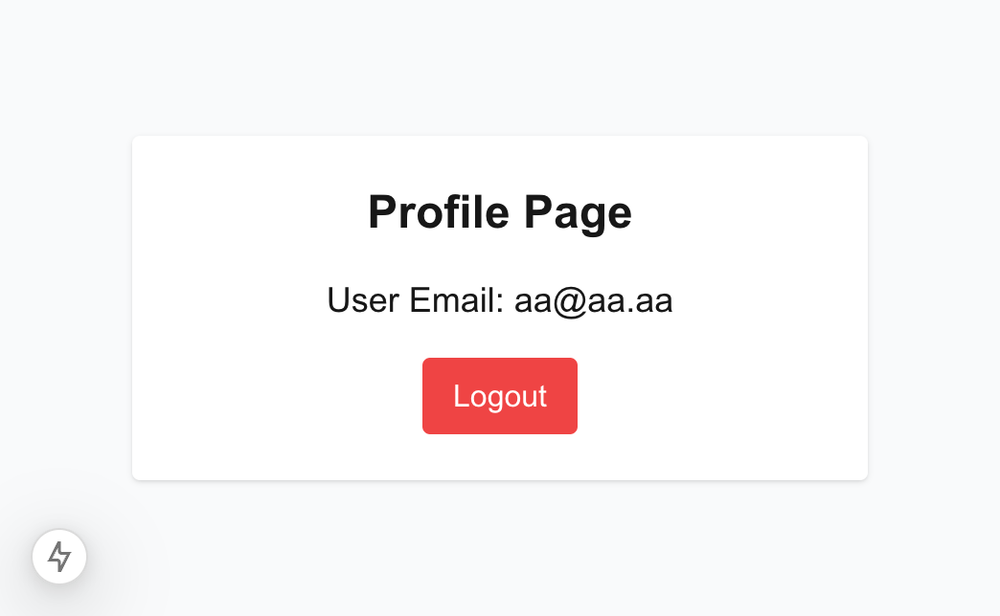

## Modern application using Next.js, TailwindCSS, NestJS, TypeORM, Passport and JWT token






## Getting Started

First, run the development server:

```bash
cd backend

npm run start:dev
```

Then, run the development frontend server:

```bash
cd frontend

npm run dev
```

Open [http://localhost:3000](http://localhost:3000) with your browser to see the result.

You can start editing the page by modifying `./frontend/src/app/page.tsx`. The page auto-updates as you edit the file.
